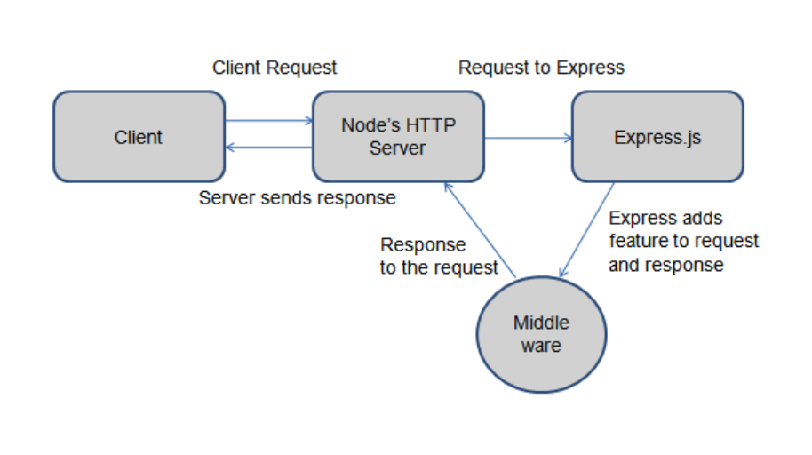
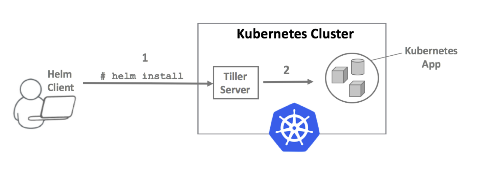

# Balaji Dama task

Here is a simple Helm chart with NodeJS application (Express based).
I've created a Docker image for that task.
Multi-stage Dockerfile is also supplied here.

## Usage

### Run application locally (without Docker) with npm

Here we initialize a node project:

```npm init```

Installing dependencies. Express server, cors and body-parser (for parsing request):

```npm install --save express cors body-parser @rama41222/node-logger```
```npm install --save-dev nodemon```


Run our application:

```npm run dev```

Application is accessible at (paste it to browser)

```localhost:8080/hello```

### Run application locally in Docker container

Build a Docker image:

```docker build -t balaji/node-express:latest .```

Run a Docker container:

```docker run -P -d balaji/node-express:latest```

Determine Docker container port:

```docker inspect $(docker ps -a --no-trunc -q) | grep HostPort```

E.g.:

```"HostPort": "32769"```

Paste to browser to access container REST endpoint:

```0.0.0.0:<port_number_from_command_above>/hello```

E.g.:

```0.0.0.0:32769/hello```

### Deploy a Helm chart to Minikube Kubernetes cluster:

Start minikube:

```minikube start --vm-driver=hyperkit```

Deploy a Helm chart with app:

```helm install balaji-app . -f values.yaml```

Wait 15 sec, then test an application:

```helm test balaji-app```

Open minikube application URL in browser:

```minikube service balaji-app```

To list installed Helm charts:

```helm list```

To delete a Helm chart:

```helm del balaji-app```

Add `/hello` to the end - it's our application REST endpoint

### BONUS POINTS: Deploy a Helm chart with Terraform

Init Terraform:

```terraform init```

Apply Terraform configurations:

```terraform apply```

To list Kubernetes pods of our application:

```kubectl get po -n default```

Enter: yes

To delete Helm chart with Terraform:

```terraform destroy```

Enter: yes

To spin down a minikube:

```minikube delete```


## Architecture diagrams
Express Web Server:



Application Deployment to local Minikube Kubernetes cluster with Helm:


